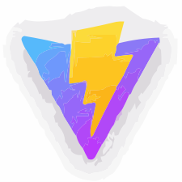

# <h1 style="color:#0B2447;text-align:center;"> Luis Angel Gonzalez </h1>

		

## <h2 style="color:#19376D;text-align:center;">Desarrollador Full Stack</h2>

 

¡Hola! Soy Luis Angel Gonzalez, un desarrollador apasionado por la tecnología. Me especializo en el desarrollo de aplicaciones tanto en el backend como en el frontend. Siempre estoy buscando aprender y mantenerme actualizado en las últimas tendencias tecnológicas.

 

###<h3 style="color:#576CBC;text-align:center;">Habilidades</h3>

- Desarrollo backend: Node.js, Java, Nest js, Laravel
- Desarrollo frontend: HTML, CSS, JavaScript, React, Vue, React Native, Next js, Denno
- Bases de datos: MongoDB, MySQL, PostgreSQL
- Control de versiones: Git

###<h3 style="color:#576CBC;text-align:center;">Proyectos Destacados</h3>

- [Portafolio con Astro ()](https://portafolio-luis-angel-gonzalez.vercel.app/)
- [Portafolio con Next ()](https://restaurant-blue-theta.vercel.app/)
- [Clon-Tesla ()](https://clon-tesla-portafolio.vercel.app/)
- [Clon-Twitter ()](https://movies-two-teal.vercel.app/react/twitter)

###<h3 style="color:#576CBC;text-align:center;">Contacto</h3>

- [:link: LinkedIn - Luis Angel Gonzalez](https://mx.linkedin.com/in/luis-angel-g%C3%B3nzalez-ambriz-7b0960120)
- [:house: Sitio web - Portafolio](https://portafolio-luis-angel-gonzalez.vercel.app/)
- [:pen: CV](https://portafolio-luis-angel-gonzalez.vercel.app/)

Fri May 26 2023 23:31:10 GMT+0000 (Coordinated Universal Time)